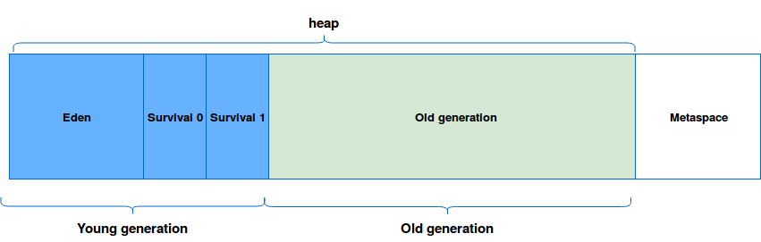
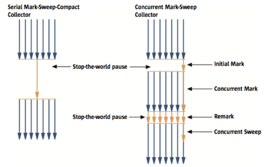
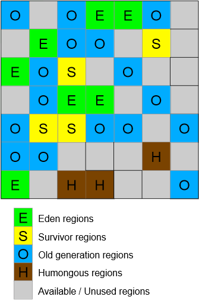

# GC ( Garbage Collection )
---
메모리에서 사용하지 않는 객체를 찾아내 사용 가능한 공간을 만드는 작업을 의미한다.

가비지 컬렉터는 아래 두가지 가설을 전제로 만들어졌다.

- 대부분의 객체는 금방 접근 불가능 상태가 된다.
- 오래된 객체에서 젊은 객체로의 참조는 아주 적게 존재한다.

이를 바탕으로 힙을 Young Generation영역과 Old Generation영역으로 나눈다.

 JVM Heap 영역 

  Young Generation영역을 주기적으로 청소하고 오랜 기간 살아남은 객체를 Old Generation으로 보낸다.

  Young Generation에서 일어나는 GC를 minor GC, Old Generation 에서 일어나는 GC를 major GC (full GC)라고 한다.

# GC 방식

## Serial GC

mark-sweep-compact 알고리즘 사용

  1. Mark : old영역의 살아있는 객체 식별 
  2. Sweep : 힙의 앞 부분부터 확인하여 살아있는 것만 남긴다 
  3. Compact : 힙의 앞 부분부터 객체들을 채워서 객체가 존재하는 부분, 없는 부분으로 나눈다. 적은 메모리와 CPU 코어 개수가 적을 때 적합한 방식이다.

**지정 방법 :**  -XX:+UseSerialGC

---

## Parallel GC

SerialGC와 같은 알고리즘을 사용한다. (Mark-sweep-compaction)

Serial는 GC를 처리하는 쓰레드가 하나, Parallel은 GC를 처리하는 쓰레드가 여러개

Parallel GC는 ThroughputGC라고도 부른다.

**장점 :**

- Serial GC에 비해 속도가 빠르다.

**단점 :**

- Mark, Sweep, Compact가 동시에 발생하여 Stop the world 시간이 소요된다.

**지정 방법 :**  -XX:+UseParallelGC

---

## Parallel Old GC(Parallel Compacting GC)

Mark-sweep-compaction의 개선된 버전인 Mark-Summary-Compact 알고리즘을 사용

Summary 단계에서는 Sweep과 달리 이미 GC가 수행된 영역에서 살아있는 객체를 식별하는 작업을 진행한다.

**지정 방법 :**  -XX:+UseParallelOldGC

---

## Concurrent Mark & Sweep GC(CMS)

1) Initial mark 
* ROOT set (Java스택, 네이티브 스택, 메서드 영역)에 의해 직접 참조되는 객체들을 Marking 한다. 멈추는 시간이 짧다.

2) Concurrent mark 
* initial mark에서 살아있다고 확인한 객체에서 참조하고 있는 객체들을 확인한다.
이 작업은 다른 쓰레드가 실행되고 있는 상황에서 진행한다. 

3) Remark 
* concurrent mark 단계에서 추가되거나 참조가 끊긴 객체를 확인한다.

4) Concurrent Sweep 
* 참조가 모든 끊긴 객체를 정리한다. 이 작업도 다른 쓰레드가 실행되고 있는 상황에서 진행한다. 
compact 단계를 진행 할 경우 다른 GC 방식에 비해 Stop the world가 길다.

**장점:**

- Stop the world 시간이  짧다.

**단점:**

- 다른 GC 방식보다 메모리와 CPU를 더 많이 사용한다.
- Compaction 단계가 기본적으로 제공되지 않는다. 그러므로 조각난 메모리가 많고 무한 Full GC가 발생할 수 있다.

**지정 방법 :**  -XX:+UseConcMarkSweepGC

---

## G1(Garbage First) GC

힙에 region이라는 개념을 도입, 연속적인 메모리 공간을 고정된 크기로 나눈다.

region은 기본적으로 2048개(2K)개의 공간으로 나눌 수 있도록 한다. 

- ex) Heap 최대 크기 : 8G —> region의 크기 4MB

만약 객체가 region 크기의 1/2보다 큰 경우 Humongous region을 사용하는데 Humongous region은 GC동작이 최적화 되어 있지 않다.

Eden, Survivor, Old영역의 역할을 동적으로 바꿔가며 GC가 일어난다.

G1 GC의 수행 과정은 Evacuation Pauses(=Minor GC), Concurrent Cycle, Mixed GC가 있다.

---

**1. Evacuation Pauses(=Minor GC)**

* eden과 survivor 에 살아있는 객체를 찾아 적절한 region에 대피시킨다. (Copying)

멀티쓰레드로 동작한다.

**2. Concurrent Cycle**

* Old Generation 영역을 GC하기 위한 사전단계로, 살아 있는 객체를 Marking 한다.

**3. Mixed GC**

* Old Generation영역에 대한 GC를 마무리 하는 단계로, Young Generation, Old Generation 영역을 동시에 GC한다.

---

**장점:**

- CMS의 문제점인 메모리의 파편화를 해결
- 상대적으로 GC 성능 우수
- 수행시간 예측 가능 , Stop the world 시간을 줄일 수 있다.
- FullGC 지속 시간, 빈도를 줄일 수 있다.

**단점:**

**지정 방법 :**  -XX:+UseG1GC